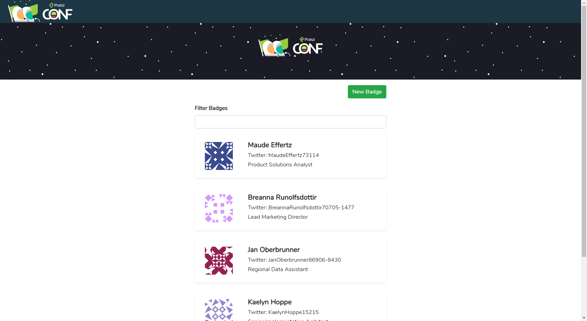
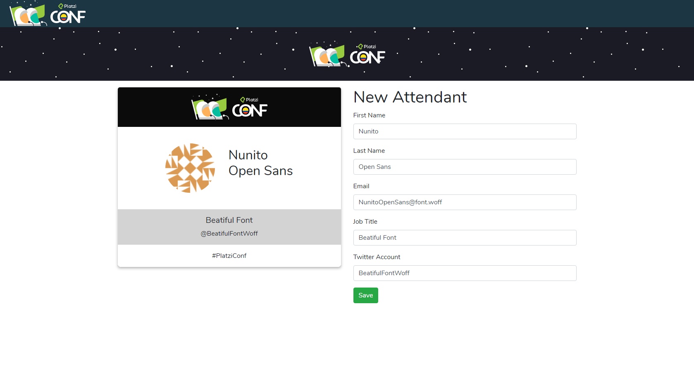
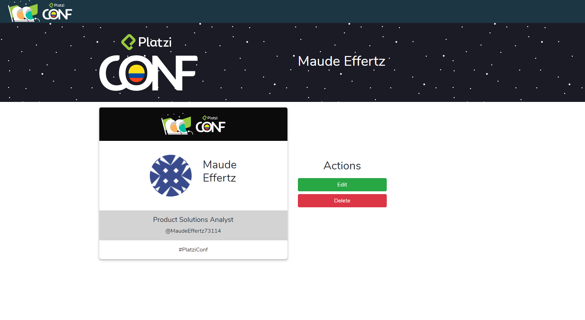

# Platzi Badges

App de badges desarrollada con React.js  

## ¿Cómo funciona?

Requiere Node.JS 10

* `npm install` para instalar dependencias
* `npm start` para el entorno de desarrollo
* `npm run build` para el entorno de producción

